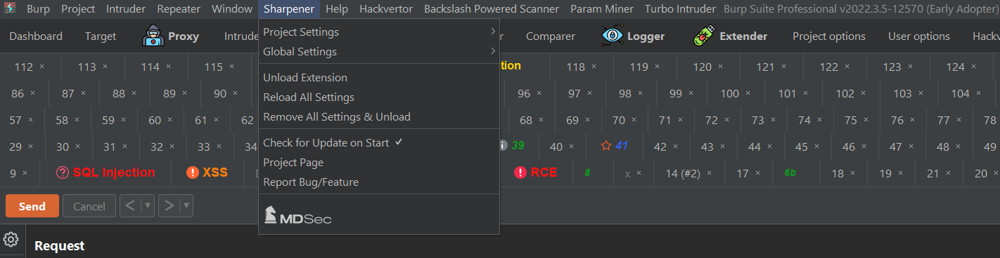
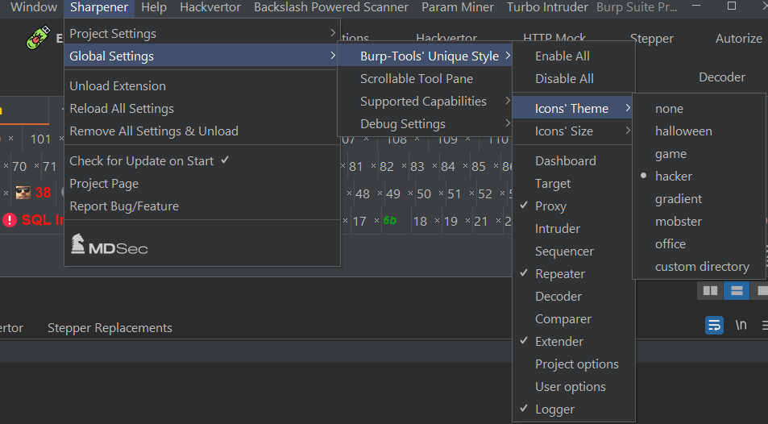
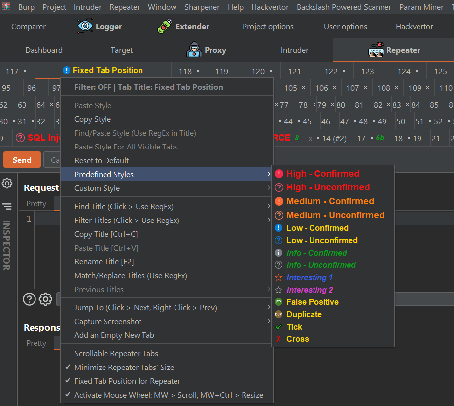
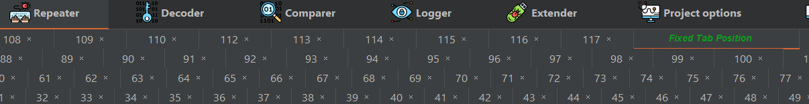
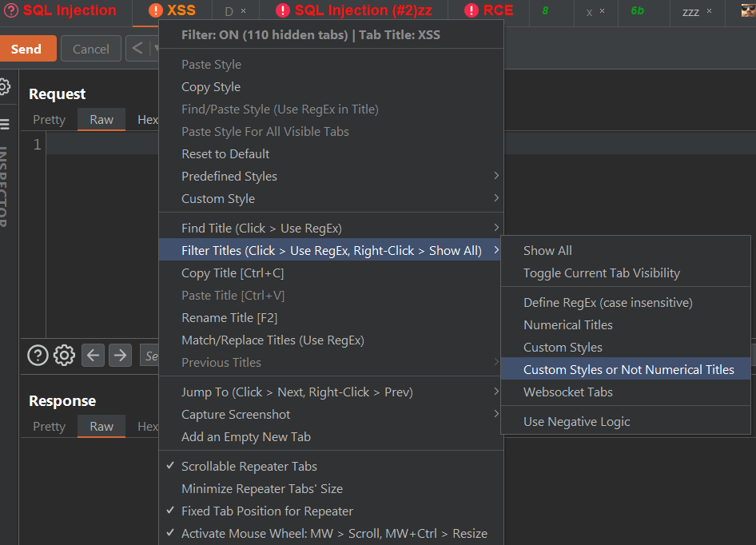
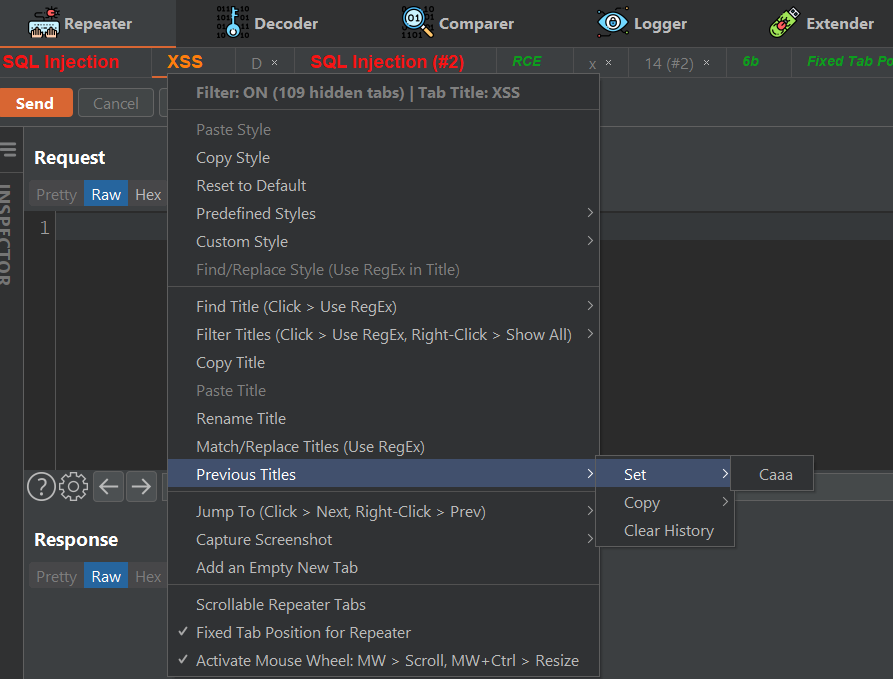
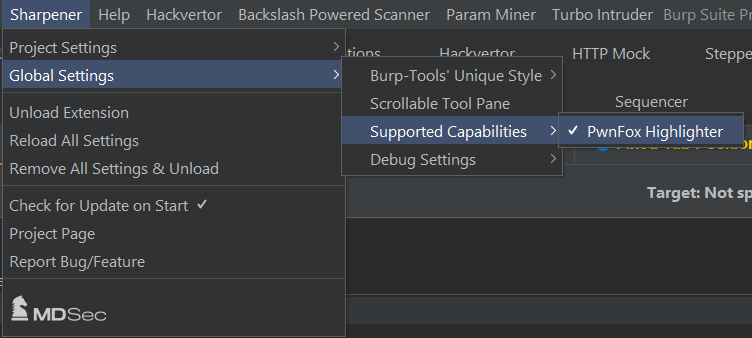
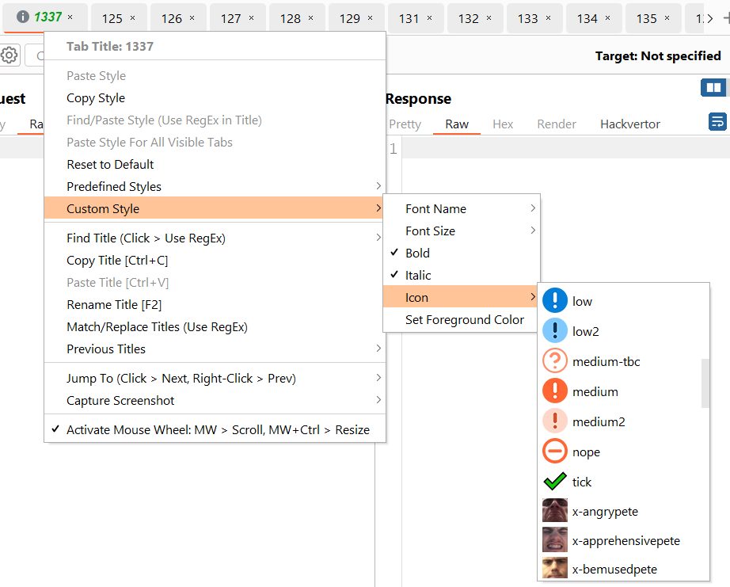
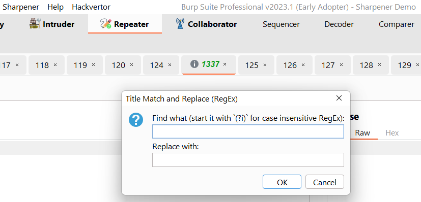

# About this repository & EOL
This repository will not be updated anymore. Please use https://github.com/irsdl/BurpSuiteSharpenerEx.

# Burp Suite Sharpener
This extension should add a number of UI and functional features to Burp Suite to make working with it a bit easier. The latest version only works with the Montoya API which should be available in Burp Suite 2023.1 or higher.

<pre>
 ___  _                                      
/ __>| |_  ___  _ _  ___  ___ ._ _  ___  _ _ 
\__ \| . |<_> || '_>| . \/ ._>| ' |/ ._>| '_>
<___/|_|_|<___||_|  |  _/\___.|_|_|\___.|_|
                    |_|
v3.6
</pre>

# Installation
* Download the latest jar file built by GitHub from [/releases/latest](https://github.com/mdsecresearch/BurpSuiteSharpener/releases/latest), or by going through the [Workflows' Artifacts](https://github.com/mdsecresearch/BurpSuiteSharpener/actions).
* Add it to Burp Suite using the Extender tab

# Using the Legacy Extension
The latest version of this extension is only compatible with Burp Suite version 2023.1 and above due to the full support of Montoya API.
The older versions of this extension can be downloaded from the legacy branch:
https://github.com/mdsecresearch/BurpSuiteSharpener/tree/Legacy-Extension/release
The legacy branch will not receive any future updates.

# Current Features
* Making main tools' tabs more distinguishable by choosing a theme
* Ability to control style of sub-tabs in Repeater and Intruder
* Ability to change Burp Suite title and its icon
* Copy & pasting style ability for Repeater and Intruder tabs
* Pasting style for Repeater and Intruder tabs when their title matches a Regular Expression
* Copy & pasting titles by creating unique titles by adding a number in the end
* Rename titles without a need to double-click on the title
* Jump to first and last tabs in Repeater and Intruder
* Back and Forward feature depends on the previously selected tabs
* Finding Repeater and Intruder tabs when their title matches a Regular Expression
* Scrollable main tool tabs
* Scrollable Repeater and Intruder tabs
* Taking screenshot of repeater or intruder tabs
* Trimming long titles into 100 characters
* Show previously chosen titles for a tab
* Several keyboard shortcuts to make the tab navigation easier
* Support for PwnFox Firefox extension highlighter
* Ability to save the last size and position of Burp Suite to move it to the same location next time
* Ability to detect off-screen Burp Suite window to bring it to the centre

# Burp Suite Compatibility and Reporting Errors
As PortSwigger has a plan to update Burp Suite UI in a near future, some features in this extension may become redundant or unreliable.
While we use this extension ourselves we can see potential errors from time to time, as an open source project, it relies on the community feedback for improvements and to fix the issues. Please report any errors in [issues](https://github.com/mdsecresearch/BurpSuiteSharpener/issues).

This extension has been tested against the latest early edition of pro version which was 2023.1 at the time of writing this document. It should however be also compatible with the community edition.

# Suggesting New Features
The plan is to add simple but effective missing features to this single extension to make tester's life easier as a must-have companion when using Burp Suite (so we cannot Burp without it!).

Please feel free to submit your new feature requests using `FR: ` in its title in [issues](https://github.com/mdsecresearch/BurpSuiteSharpener/issues).

It would be great to also list any known available extensions which might have implemented suggested features. 
Perhaps the best features can be imported from different open-source extensions so the overhead of adding different extensions can be reduced.
  
# Usage Tips
* You can use the following key combination(s) in Repeater and Intruder sub-tab menu:

| Description                                      | Combinations/Shortcuts                                                                             |
|--------------------------------------------------|----------------------------------------------------------------------------------------------------|
| Show Context Menu for Repeater and Intruder Tabs | Mouse Middle-Click Alt + Any Mouse Key Down Arrow Ctrl + Enter Ctrl + Shift +Enter |
| Find Tabs for Repeater and Intruder Tab          | Ctrl + Shift + F                                                                                   |
| Find Next                                        | F3  Ctrl + F3                                                                                  |
| Find Previous                                    | Shift + F3 Ctrl + Shift + F3                                                                   |
| Jump to the First Tab                            | Home Ctrl + Shift + Home                                                                       |
| Jump to the last Tab                             | End Ctrl + Shift + End                                                                         |
| Previous Tab                                     | Left Arrow Ctrl + Shift + Left                                                                 |
| Next Tab                                         | Right Arrow Ctrl + Shift + Right Mouse Wheel                                               |
| Back (Previously Selected Tab)                   | Alt + Left Ctrl + Alt + Left Mouse Wheel                                                   |
| Forward                                          | Alt + Right Ctrl + Alt + Right                                                                 |
| Copy Subtab Title                                | Ctrl + C Ctrl + Shift + C                                                                      |
| Paste Subtab Title                               | Ctrl + V Ctrl + Shift + V                                                                      |
| Rename Subtab Title                              | F2 Ctrl + F2                                                                                   |
| Increase Font Size                               | Ctrl + Mouse Wheel                                                                                 |
| Increase Font Size & Bold                        | Middle Click + CTRL                                                                                |
| Decrease Font Size & Bold                        | Middle Click + CTRL + SHIFT                                                                        |
| Big & Red & Bold                                 | Middle Click + SHIFT                                                                               |

* You can use the following key combination(s) on the main window frame:

| Description                                        | Combinations/Shortcuts |
|----------------------------------------------------|------------------------|
| Move Burp Suite Window to the centre of the Screen | Ctrl + Alt + C         |

* After setting style on a sub-tab, setting the same title on another sub-tab will copy its style
* Alt + Any Mouse Click works on empty parts of the tabs which do not contain any text
* Use the `Debug` option in `Global Settings` if you are reporting a bug or if you want to see what is happening
* Check the [extension's GitHub repository](https://github.com/mdsecresearch/BurpSuiteSharpener) rather than BApp Store for the latest updates
* A sample of icons should also be accessible in the `/` directory

# Thanks To
* Corey Arthur [CoreyD97](https://twitter.com/CoreyD97) for https://github.com/CoreyD97/Burp-Montoya-Utilities/
* Bruno Demarche (for initial Swing hack inspiration)

Please feel free to report bugs, suggest features, or send pull requests.
